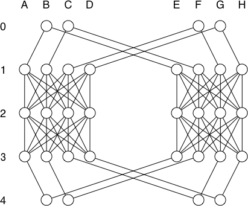
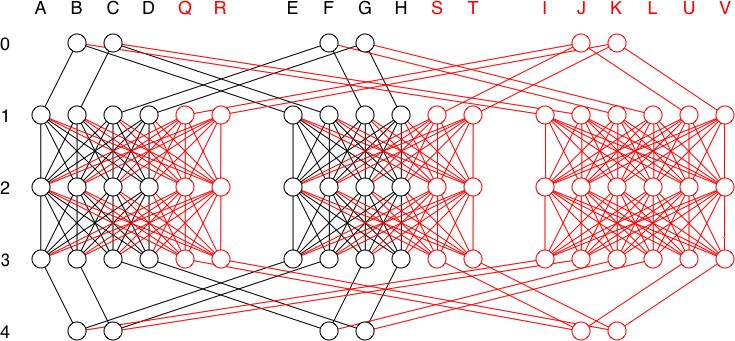

# Tests for a OpenFabric Butterfly Topology

All tests are dual-stack IPv4 and IPv6

## Test script 01 - Numbered Basic functionality
`test_fabricd_butterfly_01_numbered.py`  - Numbered topology

### Topology

### Test steps
- Bring up butterfly topology with B0 and G4 marked as Tier 0
- Verify for topology to converge
- Verify tier on all routers
- Verify routing table on all routers
- stop A1, verify routing table
- restart A1
- stop E1, verify routing table
- restart E1
- stop B2, verify routing table
- restart B2
- stop F2, verify routing table
- restart F2
- stop D3, verify routing table
- restart D3
- stop H3, verify routing table
- restart H3
- stop B0, verify routing table
- restart B0
- stop C4, verify routing table
- restart C4
- stop G0, verify routing table
- restart G0
- stop F4, verify routing table
- restart F4
- Verify routing table on all routers

## Test script 02 - Numbered Single Node marked as Tier 0
`test_fabricd_butterfly_02_numbered_single_tier0.py`  - Numbered topology

### Topology

### Test steps
- Bring up butterfly topology - with only B0 as Tier 0 marked
- Verify for topology **not** to converge (can't converge with a single Tier0 marked node)
- Mark D4 as a 2nd tier 0
- Verify for topology to converge
- Verify tier on all routers
- Verify routing table on all routers

## Test script 03 - Numbered Many nodes marked as Tier 0
`test_fabricd_butterfly_03_numbered_multiple_tier0.py` - Numbered topology

### Topology

### Test steps
- Bring up basic 4x5 topo - with B0, C0, F0, G0, B4, C4, G4, F4 as tier 0 marked
- Verify for topology to converge
- Verify tier on all routers
- Verify routing table on all routers

## Test script 04 - Numbered Expanding running topology
`test_fabricd_butterfly_04_numbered_expanding.py` - Numbered topology

### Topology

### Test steps
- Create 6x5 topology (A-F, 0-4), but start only 4x5 topology with B0 and G4 as tier 0 (other routers stay disabled)
- Verify for topology to converge
- Verify tier on all routers
- Verify routing table on all routers
- Enable remaining routers 
- Verify for topology to re-converge
- Verify tier on all routers
- Verify routing table on all routers

## Test script 05 - Numbered Basic functionality
`test_fabricd_butterfly_05_unnumbered.py`  - Unumbered topology

Same as Test script 01, but with unnumbered links. Each node only has numbered Loopback interface

## Test script 06 - Numbered Single Node marked as Tier 0
`test_fabricd_butterfly_06_unnumbered_single_tier0.py`  - Unumbered topology

Same as Test script 02, but with unnumbered links. Each node only has numbered Loopback interface

## Test script 07 - Numbered Many nodes marked as Tier 0
`test_fabricd_butterfly_07_unnumbered_multiple_tier0.py` - Unumbered topology

Same as Test script 03, but with unnumbered links. Each node only has numbered Loopback interface

## Test script 08 - Numbered Expanding running topology
`test_fabricd_butterfly_08_unnumbered_expanding.py` - Unumbered topology

Same as Test script 04, but with unnumbered links. Each node only has numbered Loopback interface

